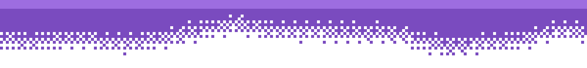
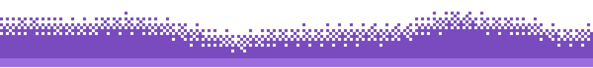

Computer Engineering student at San Jose State, focused on embedded systems, avionics, and full-stack tooling around hardware. I build multi-MCU systems end to end — sensor fusion on bare metal, wireless telemetry, and the dashboards that make the data readable — and I like problems that only show up once the hardware is actually running.

Recent work spans rocket avionics, a biometric vehicle-security build on Raspberry Pi, and a fair amount of time root-causing why servos won't behave.

---

## Experience

- **Avionics Bay Engineering Intern** — Mission College · Jun–Jul 2026
  Built a multi-MCU rocket avionics system (Raspberry Pi 5 flight computer + ESP32 servo controller) fusing IMU, barometric altimeter, and GPS over I²C/UART/SPI. Engineered a 915 MHz LoRa telemetry downlink and a full-stack live dashboard (Python WebSocket + React) streaming flight data at 20 Hz with auto-reconnect. Debugged a 4-channel TVC fin actuation system across PWM mismatch, GPIO conflicts, voltage levels, and PCA9685 oscillator miscalibration.

## Projects

- **Biometric Automobile Security System** · Mar 2026 – present
  Facial-recognition vehicle authentication on Raspberry Pi 5 (OpenCV / InsightFace) with SQLite-backed profiles and face embeddings. ESP32-controlled relays, a servo lock, and an L298N driver simulate secure door unlock and ignition control.
- **Maze Game** · Dec 2024
  3D first-person maze game in Godot with AI enemies, in-game currency, and a MySQL-backed leaderboard — player progression, enemy behavior, and reward systems.

---

## Skills

**Languages**

**Embedded & Hardware**

**Software & Vision**

**Data, Systems & Tools**

---

## Stats

---

